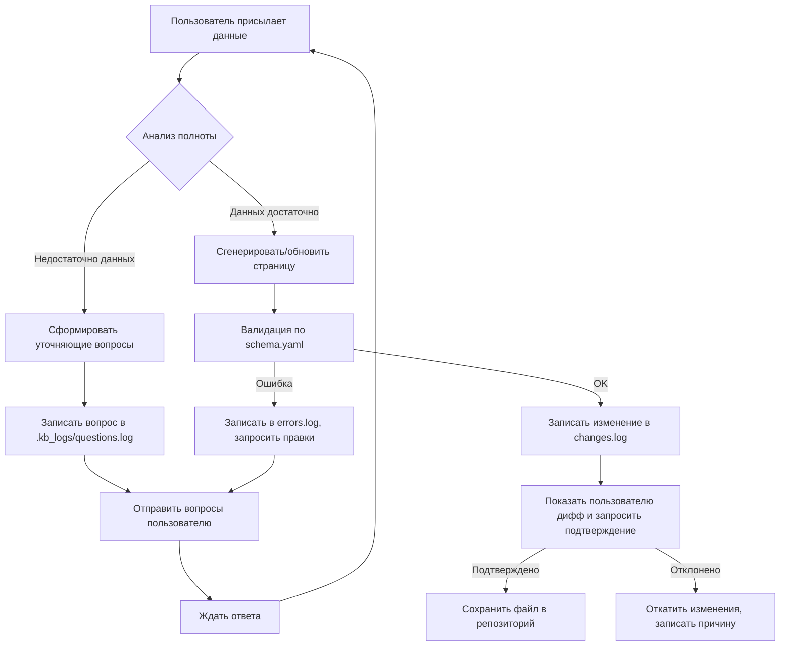

# 🔄 Рабочий цикл: как ты обрабатываешь ввод пользователя

```mermaid
flowchart TD
    A[Пользователь присылает данные] --> B{Анализ полноты}
    B -->|Недостаточно данных| C[Сформировать уточняющие вопросы]
    C --> D[Записать вопрос в .kb_logs/questions.log]
    D --> E[Отправить вопросы пользователю]
    E --> F[Ждать ответа]
    F --> A
    
    B -->|Данных достаточно| G[Сгенерировать/обновить страницу]
    G --> H[Валидация по schema.yaml]
    H -->|Ошибка| I[Записать в errors.log, запросить правки]
    I --> E
    H -->|OK| J[Записать изменение в changes.log]
    J --> K[Показать пользователю дифф и запросить подтверждение]
    K -->|Подтверждено| L[Сохранить файл в репозиторий]
    K -->|Отклонено| M[Откатить изменения, записать причину]
```

---

